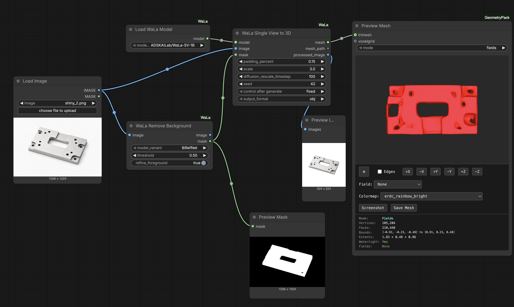
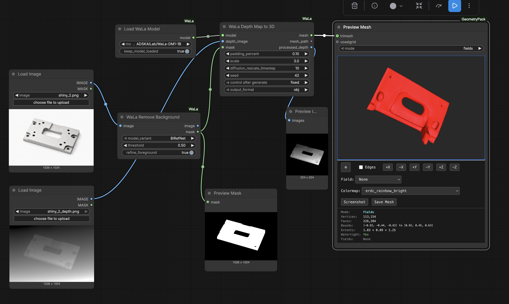

# ComfyUI-WaLa

ComfyUI custom nodes for [WaLa](https://github.com/AutodeskAILab/WaLa) - a billion-parameter 3D generative model.

> **Note:** Only **single-view image** and **depth map** inputs are tested. Multi-view, pointcloud, and text-to-3D modes are included but not actively maintained. For those use cases, consider [TRELLIS2](https://github.com/microsoft/TRELLIS) which produces significantly better results.

## Workflows

Two workflows are implemented and tested:

### Single Image to 3D


### Depth Map to 3D


## Features

WaLa supports multiple input modalities for 3D generation:
- **Single-view image** → 3D mesh
- **Multi-view images** (4 views) → 3D mesh
- **Depth maps** (1, 4, or 6 views) → 3D mesh
- **Pointcloud** → 3D mesh
- **Text** → 3D mesh (via MVDream)

## Available Nodes

### Model Loaders
| Node | Description |
|------|-------------|
| **Load WaLa Model** | Load WaLa models for 3D generation |
| **Load WaLa MVDream** | Load MVDream for text-to-3D |

### Inference Nodes
| Node | Description |
|------|-------------|
| **WaLa Single View to 3D** | Generate 3D from a single image |
| **WaLa Multi-View to 3D** | Generate 3D from 4 multi-view images |
| **WaLa Depth Map to 3D** | Generate 3D from depth map(s) |
| **WaLa Pointcloud to 3D** | Generate 3D from pointcloud |
| **WaLa Text to Depth Maps** | Generate depth maps from text |
| **WaLa Text to Multi-View** | Generate multi-view RGB from text |

### Export Nodes
| Node | Description |
|------|-------------|
| **WaLa Export OBJ** | Export mesh to OBJ file |
| **WaLa Render Preview** | Render multi-view preview images |
| **WaLa Render Video** | Render rotating video |

## Supported Models

### WaLa Models
- `ADSKAILab/WaLa-SV-1B` - Single-view
- `ADSKAILab/WaLa-RGB4-1B` - Multi-view (4 RGB)
- `ADSKAILab/WaLa-DM1-1B` - Single depth map
- `ADSKAILab/WaLa-DM4-1B` - 4 depth maps
- `ADSKAILab/WaLa-DM6-1B` - 6 depth maps
- `ADSKAILab/WaLa-PC-1B` - Pointcloud

### MVDream Models
- `ADSKAILab/WaLa-MVDream-DM6` - Text to 6 depth maps
- `ADSKAILab/WaLa-MVDream-RGB4` - Text to 4 multi-view RGB

## Optimal Parameters

| Model | Scale | Timestep |
|-------|-------|----------|
| Single-View RGB | 1.8 | 5 |
| Multi-View RGB | 1.3 | 5 |
| Multi-View Depth (4) | 1.3 | 5 |
| Multi-View Depth (6) | 1.5 | 10 |
| Text to 3D | 1.5 | 10 |
| Pointcloud | 1.3 | 8 |

## Installation

1. Clone this repository into your ComfyUI custom_nodes folder:
```bash
cd ComfyUI/custom_nodes
git clone https://github.com/YOUR_USERNAME/ComfyUI-WaLa.git
```

2. Install dependencies:
```bash
pip install -r requirements.txt
```

3. Restart ComfyUI

## Requirements

- PyTorch
- pytorch-lightning
- transformers
- diffusers
- open3d
- trimesh
- h5py
- pymcubes
- pytorch-wavelets
- spconv-cu121

## Credits

- [WaLa](https://github.com/AutodeskAILab/WaLa) by Autodesk AI Lab
- [ComfyUI](https://github.com/comfyanonymous/ComfyUI)

## License

This project wraps the WaLa model. Please refer to the [WaLa repository](https://github.com/AutodeskAILab/WaLa) for licensing information.
